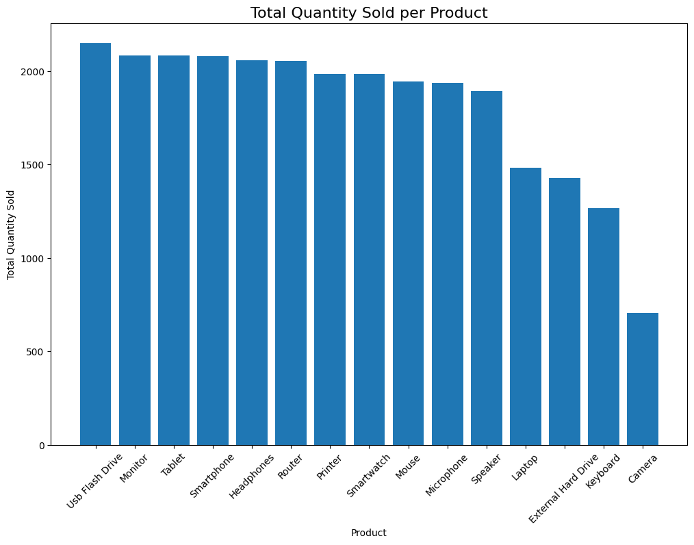
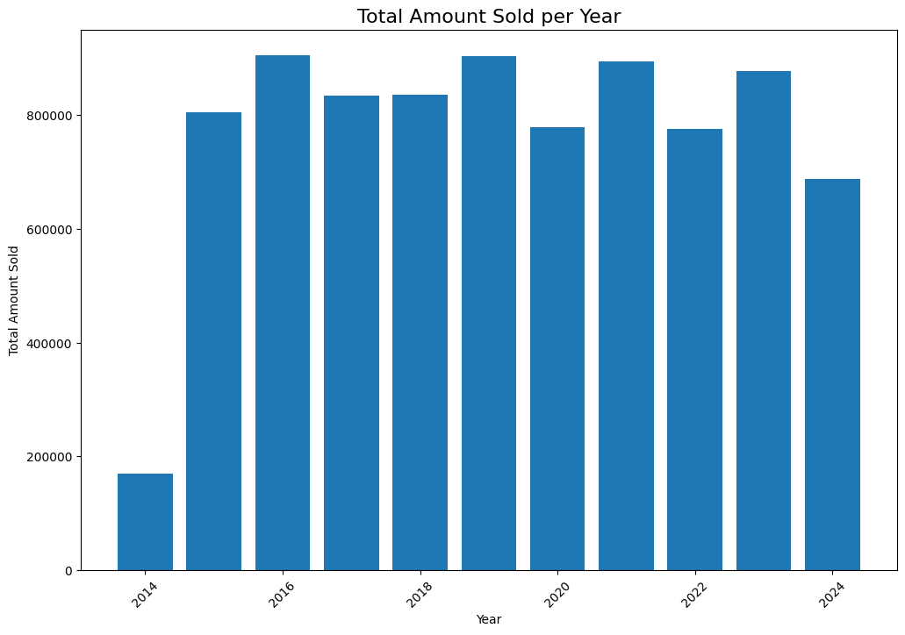

# Trend Analysis: Comprehensive Data Cleaning

This project demonstrates data cleaning techniques on a customer sales dataset for a fictional electronics company. The goal is to walk through the necessary steps for efficient data analysis and visualization, producing accurate and actionable insights for key decision-making.

## Table of Contents
- [Introduction](#introduction)
- [Features](#features)
- [Results](#results)
- [Installation](#installation)
- [Usage](#usage)
- [Project Structure](#project-structure)

## Introduction

Data cleaning is a crucial part of any data analysis process. In this project, we handle missing values, standardize data formats, remove duplicates, detect and handle outliers, and visualize cleaned data. This process ensures that the dataset is clean and ready for further analysis or modeling.

## Features

- **Missing Value Handling:** Detect and impute or drop missing values where applicable.
- **Duplicate Detection:** Identify and remove duplicate rows or partial duplicates based on key identifiers.
- **Date Standardization:** Standardize date formats to maintain consistency.
- **Capitalization Standardization:** Ensure uniform capitalization across name, email, and product fields.
- **Outlier Detection:** Use the interquartile range (IQR) method to detect outliers and visualize them using box plots.
- **Data Cleaning Visualizations:** Display insights after cleaning through bar charts for total sales by product and total amount sold per year.

## Results

After cleaning the dataset, you will obtain:

### Total Quantity Sold per Product:

_A bar chart showing the total quantity of each product sold._



### Total Amount Sold per Year:

_A bar chart displaying the total sales amount for each year._



## Installation

1. **Clone the repository**

   ```bash
   git clone https://github.com/blotetheodorus/data-cleaning-analysis.git
   cd data-cleaning-analysis
   ```

2. **Create a virtual environment**
 
   ```bash
   python -m venv venv
   source venv/bin/activate # On Windows: venv\Scripts\activate
   ```

3. **Install dependencies**

   ```bash
   pip install -r requirements.txt
   ```

## Usage

1. **Launch Jupyter notebook**

   ```bash
   jupyter notebook
   ```
   
2. **Open the notebook**

   Open data_cleaning_analysis.ipynb and run the cells sequentially to perform the analysis.

## Project structure

```
data-cleaning-analysis/
├── data_cleaning_analysis.ipynb
├── visualisations/
│   ├── quantity_sold_per_product.png
│   ├── total_amount_sold_per_year.png
├── customer_sales.csv
├── requirements.txt
└── README.md

```
